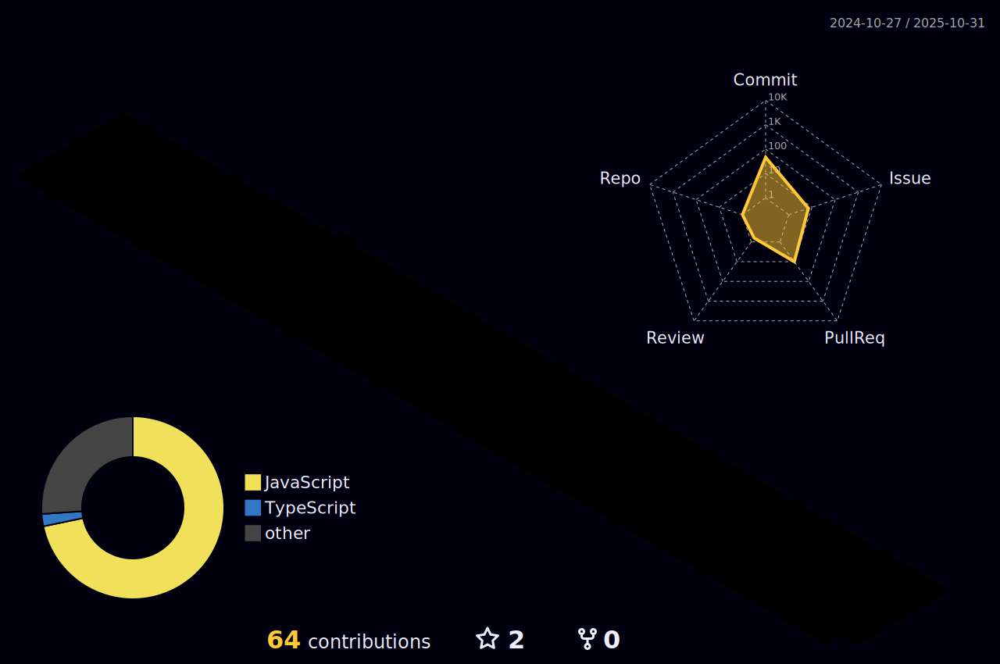

|  |  |
| ----------- | ----------- |

# Hi there 👋, I'm Lucas

👨🏻‍💻 I'm a Full-stack Developer, passionate about solving problems with programming.

### About me:
<ul>
  <li>:heart: Searching for projects to collaborate using React, Next and TS.</li>
  <li>⚙️ Learning all about <strong>Front-End World</strong></li>
  <li>:books: Graduated I.T. at IFMS, and studing S.I. at Estácio.</li>
</ul>

## Technologies

   
   

<h2 align="center"> 👍 Follow me</h2>
 

 
  
  
    
 
 
